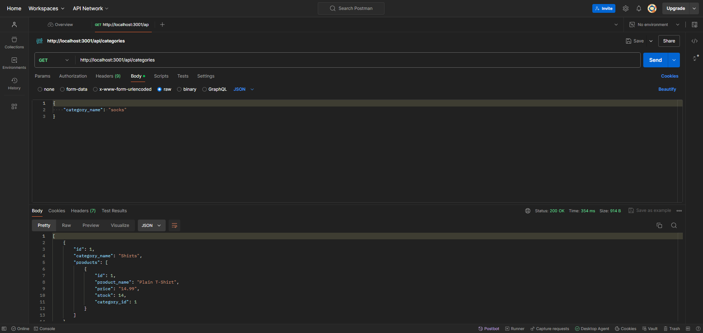

# eCommerce-backend

## Table of Contents

<ol>
<li>
<a href="#description"> Description </a>
</li>
<li><a href="#installation"> Installation </a>
</li>
<li>
<a href="#executing-program"> Executing program </a>
</li>
<li><a href="#usage"> Usage </a>
</li>
<li><a href="#contribution"> Contribution </a>
</li>
<li>
<a href="#tests"> Tests </a>
</li>
<li>
<a href="#screenshot-and-video"> Screenshot and Video </a>
</li>
</ol>

## Description

Building the backend for an e-commerce site using Express and Sequelize to interact with PostgreSQL

## Installation

```
npm i
```

<ins>Dependencies used:</ins>\
dotenv\
express\
pg\
sequelize

## Executing program

After installation
<br>

```
First..
psql -U postgres

input your password..
then
```

```
If you are not in db folder
\i db/schema.sql

If you are in db folder
\i schema.sql

After either of two above..
\q
to exit
```

```
Lastly...
npm run seed && npm run start
```

Then open Postman or Insomnia and try to make requests

## Usage

Create, update, delete items in backend of e-commerce. \
Can be performed on categories, products, and tags.

## Contribution

Git clone or fork the repository and create a feature for me ❤️

## Tests

Try GET POST PUT DELETE calls!

## Screenshot and Video

The following video shows the application's appearance and functionality:\
Click on the image below for a video

[](./assets/videos/e-commerce%20backend.mp4)
